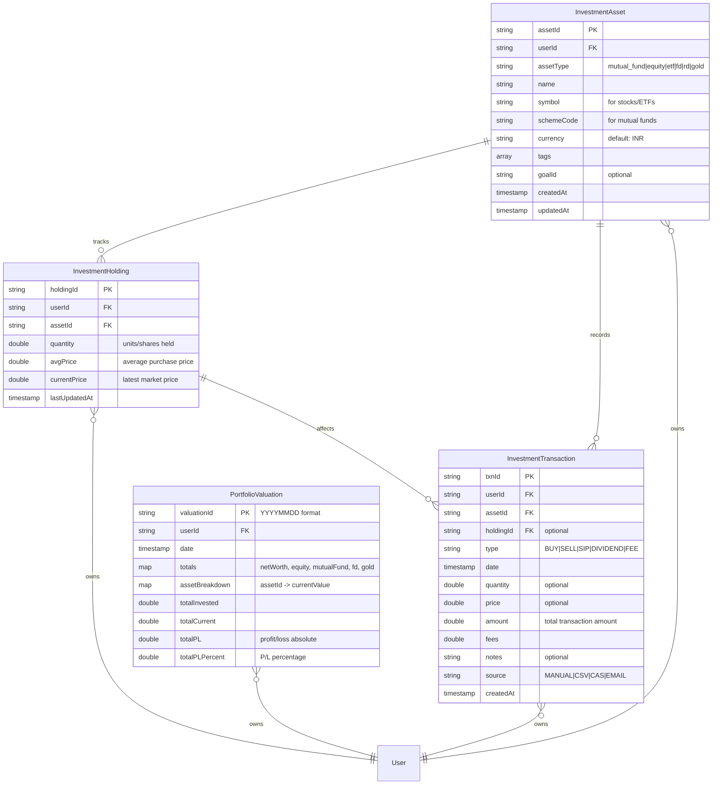

# Investment Tracking Data Models - Visual Overview

## Entity Relationship Diagram



## Detailed Model Breakdown

### 1. InvestmentAsset (Master Record)

| Field | Type | Description | Example |
|-------|------|-------------|---------|
| **assetId** | String (PK) | Unique identifier | `asset_abc123` |
| **userId** | String (FK) | Owner reference | `user_xyz789` |
| **assetType** | String | Asset category | `mutual_fund`, `equity`, `etf`, `fd`, `rd`, `gold` |
| **name** | String | Display name | `Axis Bluechip Fund`, `RELIANCE` |
| **symbol** | String? | Stock/ETF ticker | `RELIANCE`, `NIFTYBEES` |
| **schemeCode** | String? | Mutual fund code | `120503` (AMFI code) |
| **currency** | String | Default: INR | `INR`, `USD` |
| **tags** | List<String> | User categories | `["long-term", "high-risk"]` |
| **goalId** | String? | Link to goal | `goal_retirement` |
| **createdAt** | DateTime | Creation time | `2025-01-15T10:30:00Z` |
| **updatedAt** | DateTime | Last modified | `2025-01-15T10:30:00Z` |

**Computed Properties:**
- `identifier` → Returns symbol or schemeCode or first 8 chars of assetId
- `assetTypeDisplay` → Human-readable type (e.g., "Mutual Fund", "Stock")

---

### 2. InvestmentHolding (Current Position)

| Field | Type | Description | Example |
|-------|------|-------------|---------|
| **holdingId** | String (PK) | Unique identifier | `holding_def456` |
| **userId** | String (FK) | Owner reference | `user_xyz789` |
| **assetId** | String (FK) | Asset reference | `asset_abc123` |
| **quantity** | double | Units/shares held | `150.5` units |
| **avgPrice** | double | Avg purchase price | `₹125.50` per unit |
| **currentPrice** | double? | Latest market price | `₹142.30` per unit |
| **lastUpdatedAt** | DateTime | Last update time | `2025-11-09T14:30:00Z` |

**Auto-Calculated Properties:**
- `currentValue` → `quantity * currentPrice` = `₹21,416.15`
- `investedAmount` → `quantity * avgPrice` = `₹18,887.75`
- `unrealizedPL` → `currentValue - investedAmount` = `₹2,528.40`
- `unrealizedPLPercent` → `(unrealizedPL / investedAmount) * 100` = `+13.39%`
- `hasPriceData` → `currentPrice != null && currentPrice > 0`
- `plDisplay` → `+₹2,528.40` (formatted with sign)
- `plPercentDisplay` → `+13.39%` (formatted with sign)

**Static Helper:**
- `calculateNewAvgPrice()` → Weighted average calculation for BUY transactions

---

### 3. InvestmentTransaction (Activity History)

| Field | Type | Description | Example |
|-------|------|-------------|---------|
| **txnId** | String (PK) | Unique identifier | `txn_ghi789` |
| **userId** | String (FK) | Owner reference | `user_xyz789` |
| **assetId** | String (FK) | Asset reference | `asset_abc123` |
| **holdingId** | String? (FK) | Holding reference | `holding_def456` |
| **type** | String | Transaction type | `BUY`, `SELL`, `SIP`, `DIVIDEND`, `FEE` |
| **date** | DateTime | Transaction date | `2025-10-15` |
| **quantity** | double? | Units traded | `50.5` units |
| **price** | double? | Price per unit | `₹125.50` |
| **amount** | double | Total amount | `₹6,337.75` |
| **fees** | double | Charges/brokerage | `₹12.50` |
| **notes** | String? | User notes | `"SIP installment"` |
| **source** | String | Entry method | `MANUAL`, `CSV`, `CAS`, `EMAIL` |
| **createdAt** | DateTime | Record creation | `2025-11-09T14:30:00Z` |

**Computed Properties:**
- `isAcquisition` → `type == 'BUY' || type == 'SIP'` (increases holdings)
- `isDisposal` → `type == 'SELL'` (decreases holdings)
- `isIncome` → `type == 'DIVIDEND'` (generates income)
- `isCost` → `type == 'FEE'` (expense)
- `xirrCashflow` → Cashflow for XIRR calculation (negative for investments, positive for returns)
- `typeDisplay` → `"Buy"`, `"Sell"`, `"SIP"`, etc.
- `sourceDisplay` → `"Manual Entry"`, `"CSV Import"`, etc.
- `amountDisplay` → `-₹6,337.75` (BUY) or `+₹7,500.00` (SELL)

---

### 4. PortfolioValuation (Daily Snapshot)

| Field | Type | Description | Example |
|-------|------|-------------|---------|
| **valuationId** | String (PK) | Date in YYYYMMDD | `20251109` |
| **userId** | String (FK) | Owner reference | `user_xyz789` |
| **date** | DateTime | Snapshot date | `2025-11-09` |
| **totals** | Map<String, double> | Category totals | `{netWorth: 500000, equity: 200000, mutualFund: 150000, fd: 100000, gold: 50000}` |
| **assetBreakdown** | Map<String, double> | Per-asset values | `{asset_abc123: 21416.15, asset_def456: 35000.00, ...}` |
| **totalInvested** | double | Total invested | `₹450,000` |
| **totalCurrent** | double | Total current value | `₹500,000` |
| **totalPL** | double | Absolute P/L | `₹50,000` |
| **totalPLPercent** | double | P/L percentage | `11.11%` |

**Computed Properties:**
- `netWorth` → `totals['netWorth']` = `₹500,000`
- `equityValue` → `totals['equity'] + totals['etf']` = `₹200,000`
- `mutualFundValue` → `totals['mutualFund']` = `₹150,000`
- `debtValue` → `totals['fd'] + totals['rd']` = `₹100,000`
- `goldValue` → `totals['gold']` = `₹50,000`
- `allocationPercents` → `{equity: 40%, mutualFund: 30%, debt: 20%, gold: 10%}`
- `plDisplay` → `+₹50,000.00`
- `plPercentDisplay` → `+11.11%`
- `netWorthCompact` → `₹5.00L` (formatted: K/L/Cr)

**Static Helper:**
- `generateId(DateTime)` → Converts date to `YYYYMMDD` format

---

## Data Relationships & Flow

### 1. Asset → Holding Relationship (1:1)
```
InvestmentAsset (assetId: asset_abc123)
    ↓
InvestmentHolding (assetId: asset_abc123, quantity: 150.5, avgPrice: 125.50)
```
**Rule:** Each asset can have at most ONE holding per user (current position)

### 2. Asset → Transaction Relationship (1:N)
```
InvestmentAsset (assetId: asset_abc123)
    ↓
InvestmentTransaction (txnId: txn_001, type: BUY, quantity: 50, date: 2025-01-15)
InvestmentTransaction (txnId: txn_002, type: BUY, quantity: 50, date: 2025-05-20)
InvestmentTransaction (txnId: txn_003, type: BUY, quantity: 50.5, date: 2025-10-15)
```
**Rule:** Each asset can have MULTIPLE transactions (complete history)

### 3. Transaction → Holding Updates
```
NEW BUY Transaction (50 units @ ₹125.50)
    ↓
Update Holding:
  - New quantity: 150.5 units (100.5 + 50)
  - New avgPrice: ₹125.50 (weighted average)
```

### 4. Daily Valuation Snapshot
```
PortfolioValuation (date: 2025-11-09)
    ↓
Aggregates ALL holdings:
  - InvestmentHolding 1 (currentValue: ₹21,416.15)
  - InvestmentHolding 2 (currentValue: ₹35,000.00)
  - InvestmentHolding 3 (currentValue: ₹15,500.00)
    ↓
Computes:
  - totals: {equity: ₹21,416.15, fd: ₹50,000, ...}
  - assetBreakdown: {asset_abc123: ₹21,416.15, ...}
  - totalCurrent: ₹500,000
  - totalPL: ₹50,000
```

---

## Transaction Type Examples

| Type | Description | Quantity | Price | Amount | Effect on Holding |
|------|-------------|----------|-------|--------|-------------------|
| **BUY** | Purchase units | 50 | ₹125.50 | ₹6,275 | ↑ Increases quantity, updates avgPrice |
| **SELL** | Sell units | 20 | ₹142.30 | ₹2,846 | ↓ Decreases quantity, avgPrice unchanged |
| **SIP** | Systematic investment | 10.5 | ₹130.00 | ₹1,365 | ↑ Increases quantity, updates avgPrice |
| **DIVIDEND** | Income received | - | - | ₹500 | No change to quantity |
| **FEE** | Charges/expenses | - | - | ₹12.50 | No change to quantity |

---

## XIRR Calculation Example

```
Transactions for XIRR:
  2025-01-15: BUY  → Cashflow: -₹6,275.00  (money out)
  2025-05-20: BUY  → Cashflow: -₹6,275.00  (money out)
  2025-08-10: DIV  → Cashflow: +₹500.00    (money in)
  2025-10-15: SIP  → Cashflow: -₹1,365.00  (money out)
  2025-11-09: CURR → Cashflow: +₹21,416.15 (current value)

XIRR = Calculate IRR from these cashflows → ~15.2% annualized return
```

---

## Firestore Collection Structure

```
/users/{userId}/investmentAssets/{assetId}
/users/{userId}/investmentHoldings/{holdingId}
/users/{userId}/investmentTransactions/{txnId}
/users/{userId}/portfolioValuations/{valuationId}
```

**Indexes Required:**
- `investmentTransactions`: Compound index on `(userId, assetId, date DESC)`
- `portfolioValuations`: Single field index on `(userId, date DESC)`

---

## Key Design Decisions

1. **Separation from Expenses**: Investment models are completely independent from ExpenseModel/MoneyTrackerAccount
2. **User-Scoped**: All collections are under `/users/{userId}/` for security and isolation
3. **Immutable Transactions**: Transaction records are never updated, only created (audit trail)
4. **Computed Properties**: P/L calculations are getters, not stored (always current)
5. **Daily Snapshots**: PortfolioValuation records are created once per day for historical tracking
6. **XIRR Ready**: Transaction structure supports accurate XIRR calculation with `xirrCashflow` getter
7. **Multi-Asset Support**: assetType field allows MF, stocks, ETFs, FD, RD, gold in same structure

---

## Usage Flow Example

### Adding a New Investment

1. **Create Asset**
   ```dart
   InvestmentAsset(
     assetType: 'mutual_fund',
     name: 'Axis Bluechip Fund',
     schemeCode: '120503',
   )
   ```

2. **Record BUY Transaction**
   ```dart
   InvestmentTransaction(
     type: 'BUY',
     quantity: 50,
     price: 125.50,
     amount: 6275,
   )
   ```

3. **Create/Update Holding**
   ```dart
   InvestmentHolding(
     quantity: 50,
     avgPrice: 125.50,
     currentPrice: null, // Will update later
   )
   ```

4. **Daily Valuation** (automated)
   ```dart
   PortfolioValuation(
     date: today,
     totals: calculateTotals(),
     assetBreakdown: calculateBreakdown(),
   )
   ```

### Viewing Portfolio

1. Fetch all holdings for user
2. Group by assetType
3. Display cards showing:
   - Asset name
   - Quantity held
   - Current value
   - P/L (color-coded)
4. Show allocation pie chart from latest PortfolioValuation

---

This document provides a complete visual reference for the investment tracking data models.
